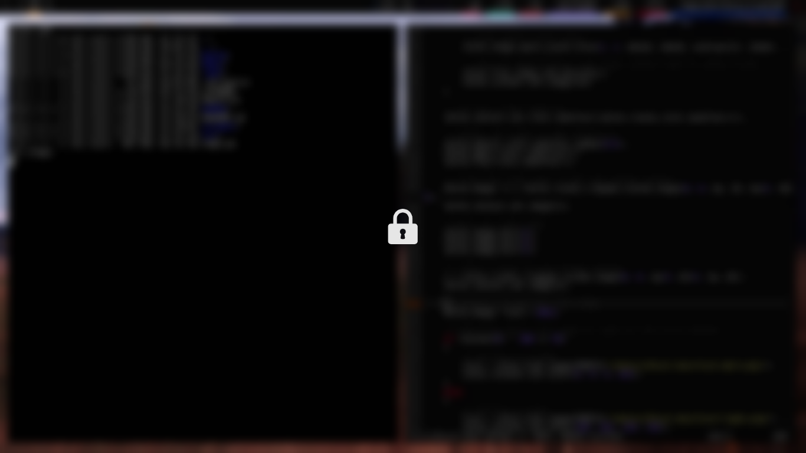

# i3lock-next

`i3lock-next` is a bash script and C helper program much like [i3lock-fancy](https://github.com/meskarune/i3lock-fancy). i3lock-next aims to be much faster by using [Imlib2](https://docs.enlightenment.org/api/imlib2/html/index.html) rather than ImageMagick, and being written (mostly) in C.

**Now with support for multiple monitors!**


[video: usage](media/video-usage.mkv)

## Dependencies

- [i3lock-color](https://github.com/chrjguill/i3lock-color) - a fork of i3lock that supports custom ring colors
- [Imlib2](https://docs.enlightenment.org/api/imlib2/html/)
- [bash](https://www.gnu.org/software/bash/)
- [fontconfig](https://www.freedesktop.org/wiki/Software/fontconfig/)
- [libXrandr](https://www.x.org/wiki/libraries/libxrandr/)

Most of these should be available via the package manager for your distribution.

## Installation

```
$ make
$ make install
```

To use a custom prefix for the installation directory:

```
$ make install PREFIX=/your/custom/prefix
```

## Usage

```
i3lock-next [-h|--help] [prompt] [font] [size]

Options:
	-h, --help  Display this help text.

	prompt      Prompt string to display, default is none.

	font        Font to to use, default is Sans.

	size        Size of font, default is 18.
```

### Examples

**Custom Font and Prompt:**

```
$ i3lock-next "Input password" "DejaVu Sans Mono" 24
```


**Default Prompt (None):**

```
$ i3lock-next
```


